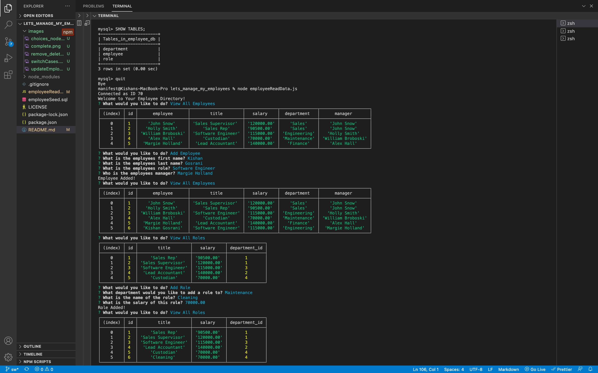
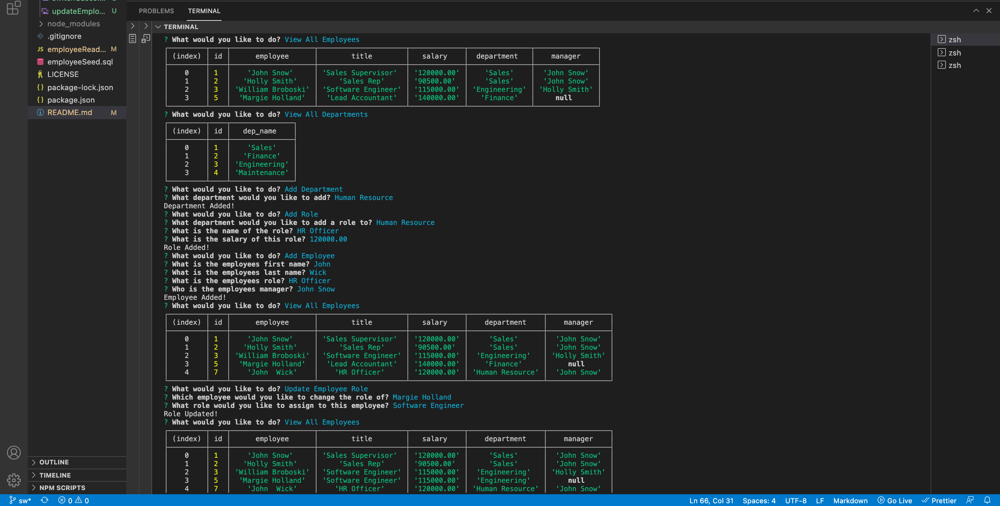
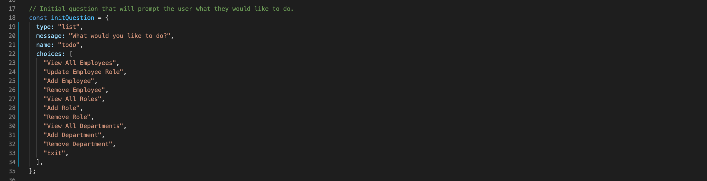
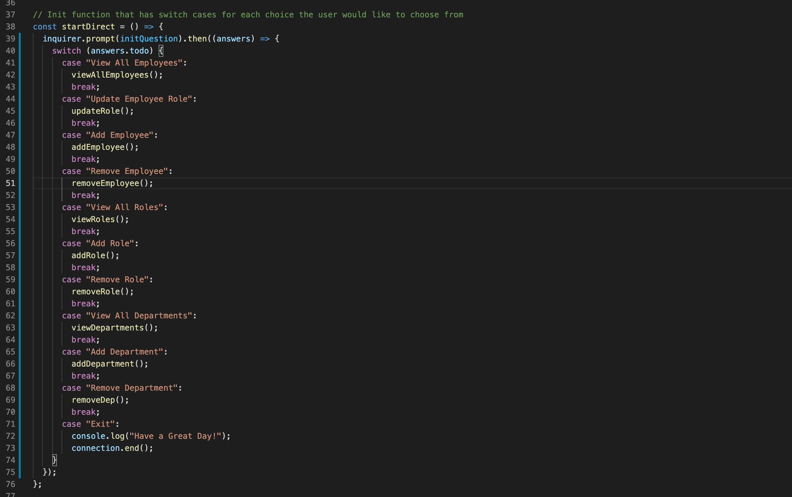
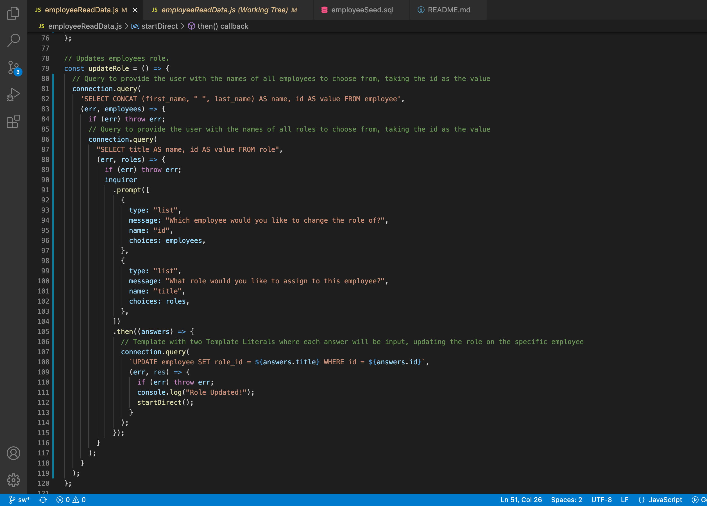
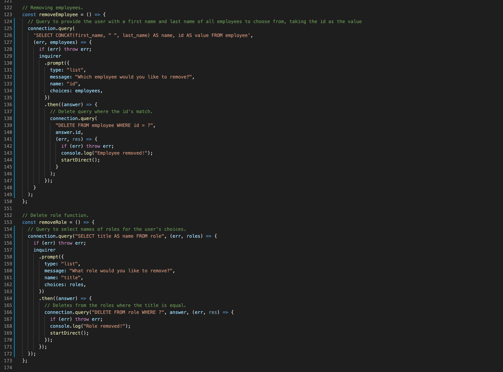
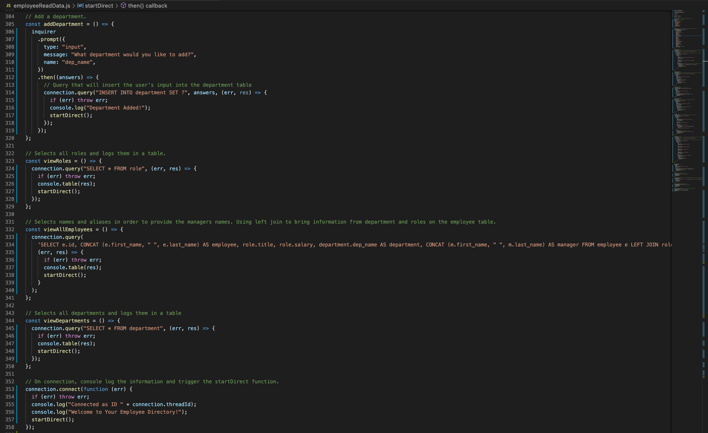

# lets_manage_my_employees

## Description

This is an Employee Tracker App which is a content management system (CMS) created using the node.js, inquirer and MySQL. In this app the user can view and manage the departments, roles and employees in their company.

![Video] ( https://drive.google.com/file/d/13PxZ-TK_eRu5QC96v6MGZ9LZtMCCMsDI/view?usp=sharing)

## Tabel of Contents

* [Installation](#installation)
* [Usage](#usage)
* [Contribute](#contribute)
* [Tests](#tests)
* [Screenshots](#screenshots)
* [Technology](#technology)
* [Making](#making)
* [Questions](#questions)

## Installation

In order to run this application, you will need to install the following

- npm instal node.js
- npm install inquirer
- npm i

## Usage

In order to use this app, you will need to understand the following;

- Node
- Inquirer
- Javascript
- MySQL

## Contribute

In order to contribute to this app, you will need to understand the following;

- Node
- Inquirer
- Javascript
- MySQL

## MySQL 

If there are issues with you MySQL deployment you can try the following steps on your terminal

- mysql --version | This will tell you if you have installed the mysql plugin and the version of it
- mysql -u root -p | This will connect you to the mql database -p is your root password
- source employeeSeed.sql | Main .sql file the database is created from
- SHOW TABLES; | shows you the 3 tables created; department, employee, & role
- quit | takes you back to your main terminal

## Tests

To run tests, please use the following command:

- npm run test

## Screenshots of deployed app

## Technology

- Github
- Javascript
- Node.js
- MySQL2
- Inquirer

## Making

These are the screenshots of the code 

CHOICES NODE.JS

SWITCH CASES FOR NODE.JS

UPDATE EMPLOYEES

REMOVE AND DELETE FUNCTIONS

COMPELETED (END) FUNCTIONS

## Questions

Please click the links below

[Github] (https://github.com/kishan254)

Write me on;

[Email] (kishan.gosrani@hotmail.com)

## License

This project is currently licensed under the MIT [License](https://choosealicense.com/licenses/mit/)
